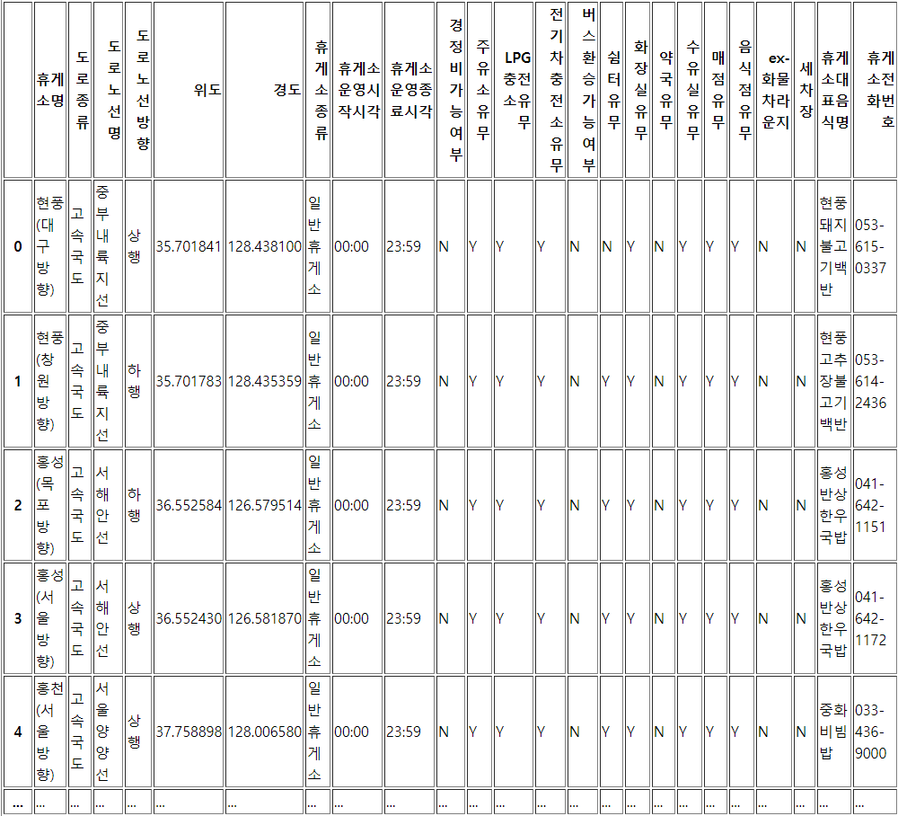
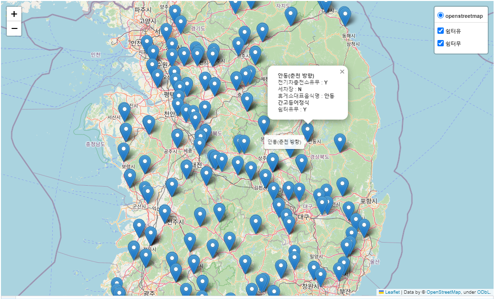
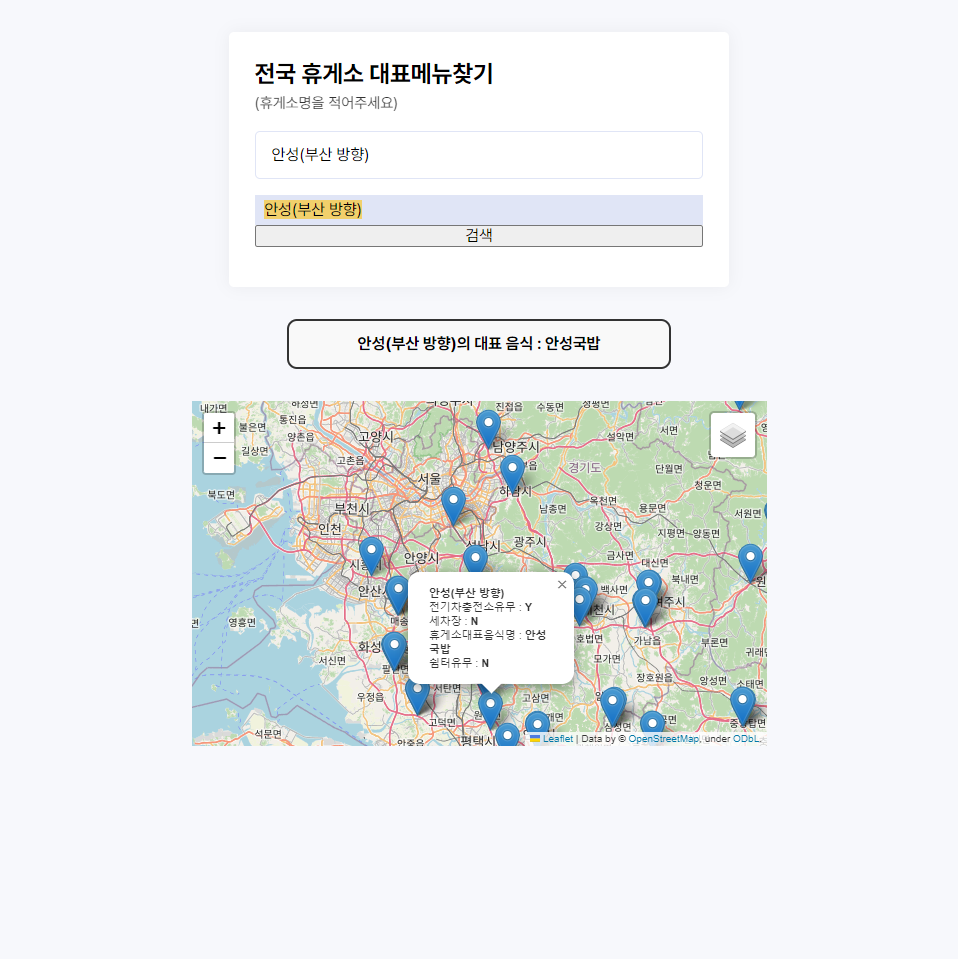

# rest-area
PyScript를 활용한 휴게소 정보 사이트 Mini Project

## 전국 휴게소 status
- DataFrame
    

- 1차 : 전국 휴게소 핀설정, 클릭 시 휴게소 옵션확인
    

- 2차 : 1차 기능 + 검색 자동완성, 검색 시 휴게소 대표음식 제공
    

출처 - inflearn : 공공데이터와 Folium(Python Library)으로 만드는 제주 오름 지도 안내 서비스
- https://www.inflearn.com/course/%ED%8C%8C%EC%9D%B4%EC%8D%AC-%ED%8F%B4%EB%A6%AC%EC%9B%80-%EC%A7%80%EB%8F%84%EC%84%9C%EB%B9%84%EC%8A%A4/dashboard

- data
    1. https://www.data.go.kr/data/15025446/standard.do
    2. http://data.ex.co.kr/portal/rest/restList
